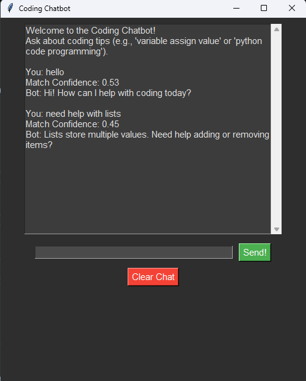

# Coding Chatbot (Offline Semantic Q&A Bot)

A fully offline coding assistant chatbot built with Python, Tkinter, and SentenceTransformers.  
It uses local NLP embeddings (no internet API calls) to understand coding-related questions and respond using semantic similarity matching from a predefined knowledge base.

---

## Features

### Offline AI System
- Fully offline after model download
- Uses `sentence-transformers` (`all-MiniLM-L6-v2`)
- Semantic similarity matching instead of keyword search
- No external APIs or cloud services required

### Coding Knowledge Base
- Large curated dataset covering:
  - Python, Java, C++, JavaScript
  - Data structures and algorithms
  - Debugging and error handling
  - Web development (Flask, Django, HTML, CSS)
  - AI and machine learning basics
  - Game development concepts
  - Databases, APIs, and more

- Built-in fallback response when confidence is too low

### NLP Matching System
- Converts user input into vector embeddings
- Compares against stored question embeddings
- Selects best match using cosine similarity
- Displays confidence score for transparency

---

## Graphical User Interface
- Built with Tkinter
- Chat-style interface
- Scrollable conversation history
- Input field with Enter-to-send support
- Clear chat button
- Dark themed UI

---

## Technologies Used
- Python 3
- SentenceTransformers
- PyTorch
- Tkinter
- Cosine similarity via util.cos_sim

---

## How to Run

1. Install dependencies:
   pip install sentence-transformers torch

2. Run the program:
   python main.py

---

## How It Works

1. User enters a message
2. Message is converted into an embedding
3. Compared with stored QA embeddings
4. Highest similarity match is selected
5. Response is returned with confidence score

---

## Notes

- Fully offline after initial model download
- Accuracy depends on dataset quality and similarity threshold (default: 0.3)
- Best suited for general coding help and explanations

---

## Author

AlexIsNotInset
